# termspot

by [fdeox](https://github.com/fdeox) — a CRT phosphor terminal theme for Spotify (via [Spicetify](https://spicetify.app)).

Scanlines, vignette, phosphor glow, a power-on warm-up, tmux-style pane chips
(`~/nav`, `~/library`, `~/playing`), a statusline playbar, terminal control
glyphs, `## ` shelf headers, `> UPPERCASE` page titles and a `>>` lyrics cursor.
Your Spotify, running on a machine from a better timeline.

> Pairs perfectly with the [Terminal Greeting](https://github.com/fdeox/spicetify-terminal-greeting)
> extension: boot log, terminal prompt with time-of-day greeting, now-playing
> ticker and night shift.


## Color schemes

Switch any time:

```
spicetify config color_scheme <SchemeName>
spicetify apply
```

| | |
|---|---|
| **Fdeox** *(default)* — green phosphor  | **FdeoxAmber** — amber phosphor 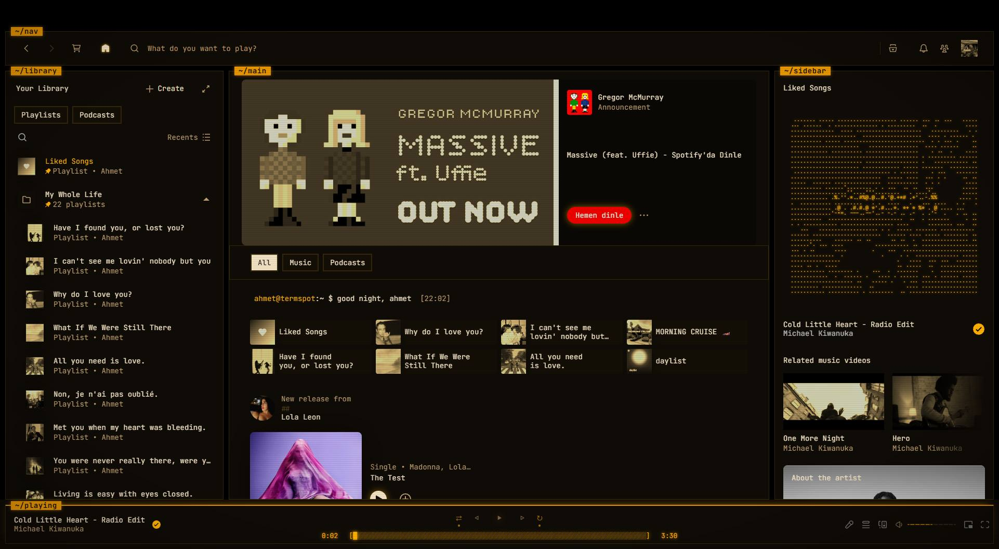 |
| **Synthwave** — neon night drive 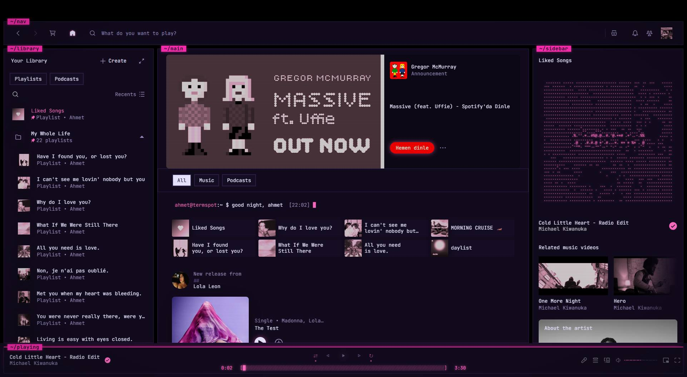 | **Arctic** — cold storage 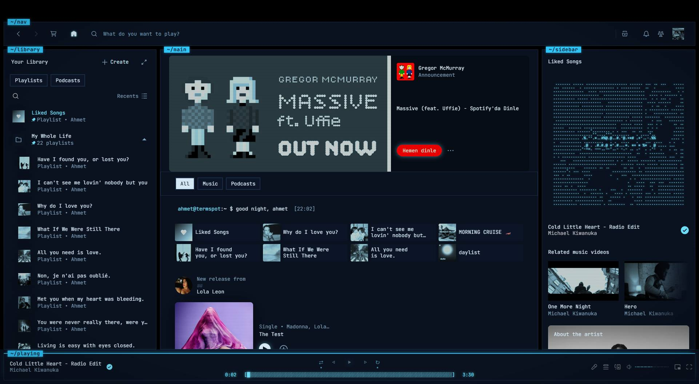 |
| **Bloodmoon** — alarm mode 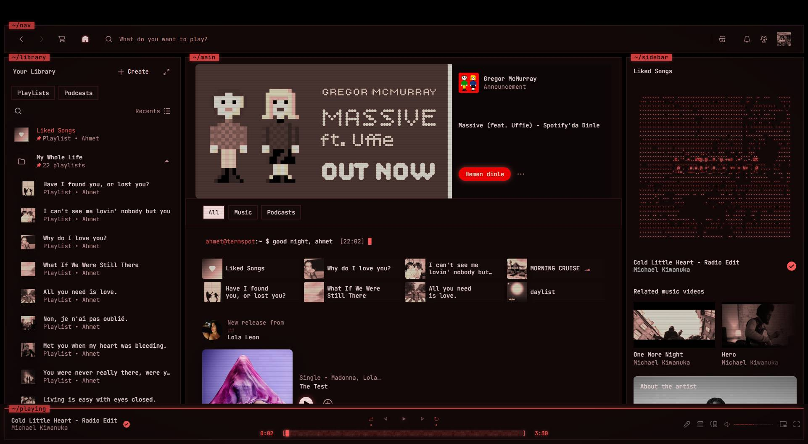 | **Ultraviolet** — blacklight 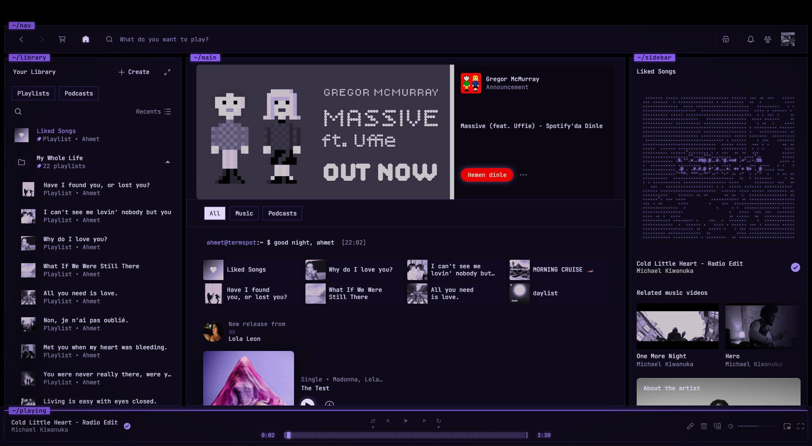 |
| **Matrix** — follow the white rabbit 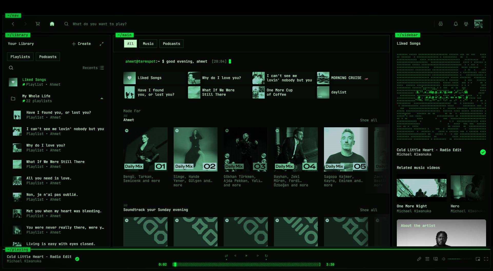 | **Gold** — the executive mainframe 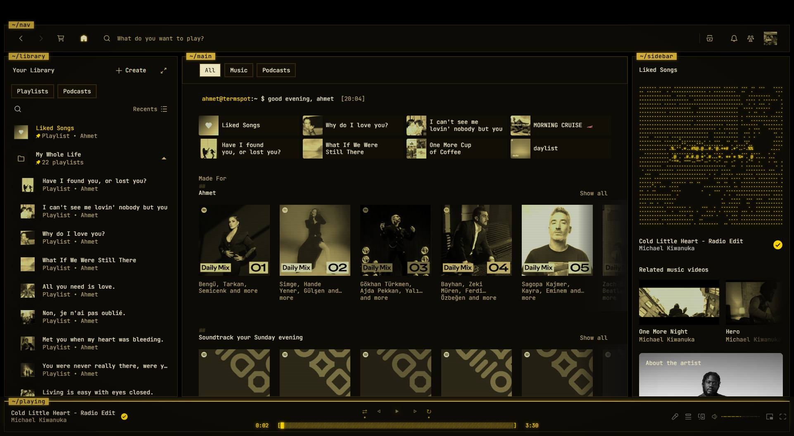 |
| **Frostbyte** — nord-inspired ice 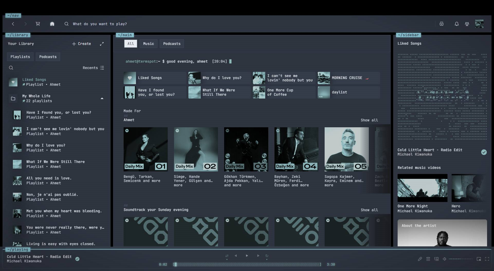 | **Nightbloom** — catppuccin-inspired pastel 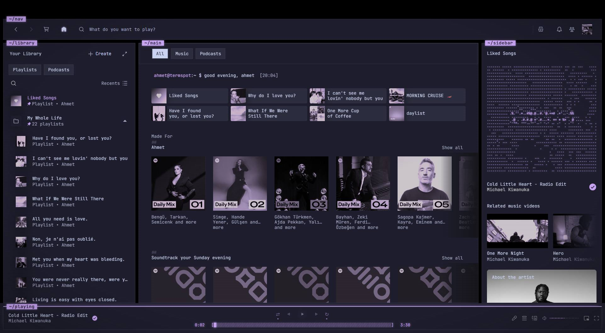 |
| **Fangs** — dracula-inspired 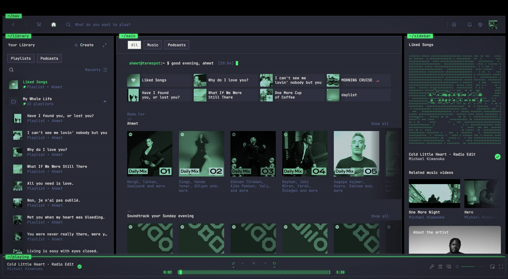 | **Paper** — e-ink daylight  |
| **Gruvbox** 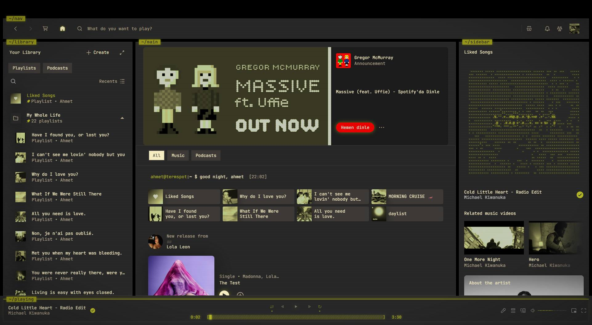 | **Bios** — press DEL to enter setup 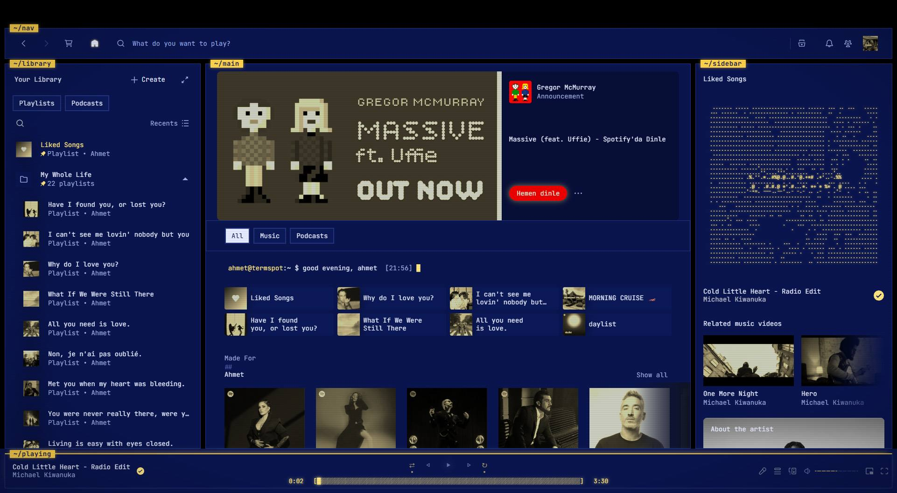 |
| **GruvboxHard** 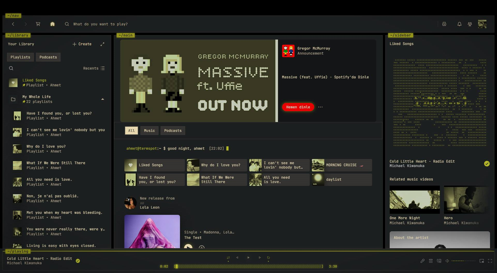 | **EverforestDarkHard**  |
| **EverforestDarkMedium** 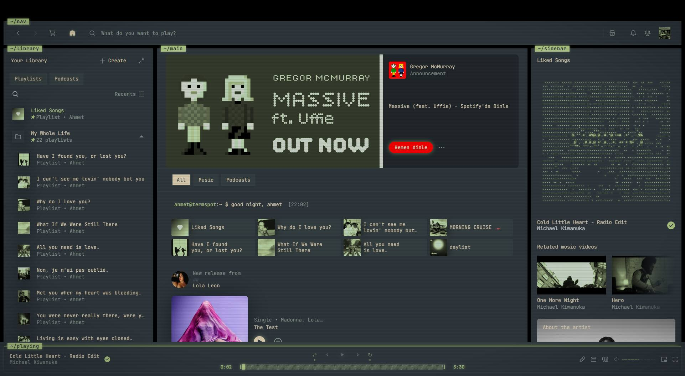 | **EverforestDarkSoft** 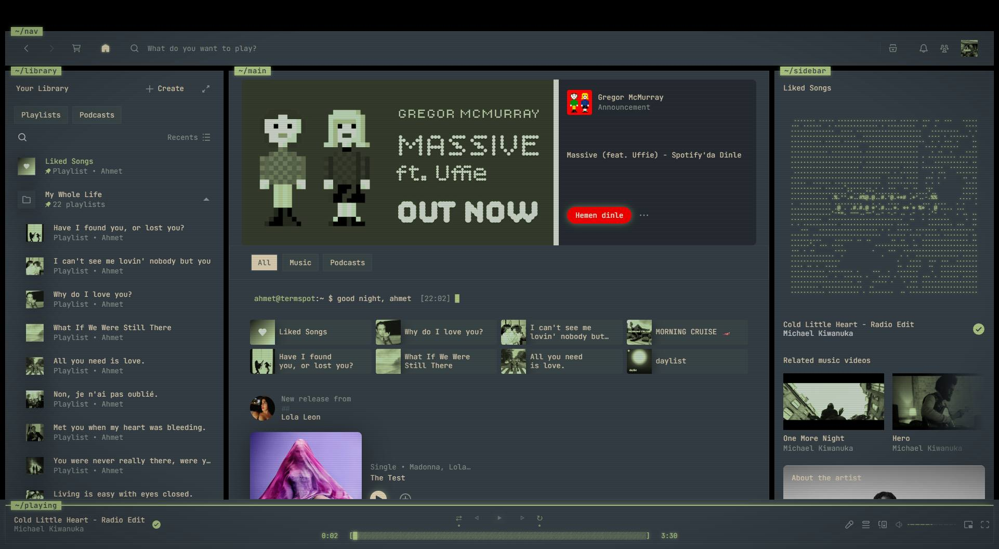 |

## Signature features

- **Hidden command terminal** — press `:` anywhere (vim style) and a terminal
  drops down; press `Esc` (or type `exit`) to close it.
  `play <song>`, `search`, `queue`, `vol 60`, `next`, `np`… full music control
  without touching the mouse. Plus `theme <name>` for live scheme previews,
  `matrix`, `coffee`, `1994` and more — start with `help`.
  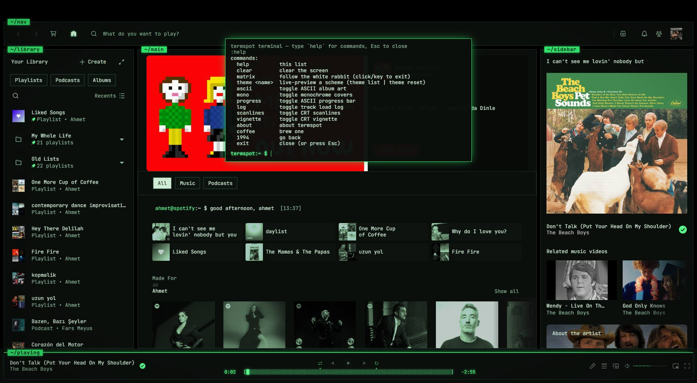
- **Live ASCII album art** — the current track's cover is redrawn as character
  art in your accent color, right in the now playing view. Hover it to peek at
  the original.

  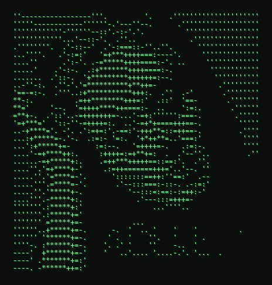
- **Monochrome phosphor covers** — every cover on the page rendered in green
  phosphor; hover any card or row and the original colors come back.
- **ASCII progress bar** — `[████████░░░░░░]` spanning the whole playbar,
  with playback times in a real seven-segment VFD display font.
- **Track load log** — on every song change:
  `reading: track_name_229.dat ........ OK`
- **Power-on warm-up** — the screen flickers to life like a real CRT.

## Settings

Everything is toggleable in-app: **Profile menu → termspot settings**
(ASCII art, monochrome covers, ASCII progress bar, track log, scanlines,
vignette, power-on animation) — or straight from the `:` terminal.

Fine-tuning lives at the top of `user.css`:

```css
--crt-glow: 6px;         /* 0px disables the phosphor glow */
--font-size: 14px;       /* try 12px + --line-height: 1.1 for a compact look */
```

## Install

```
# copy (or symlink) this folder into your spicetify Themes folder as "termspot"
spicetify config current_theme termspot
spicetify config color_scheme Fdeox
spicetify apply
```

## Credits

Structure inspired by the [text](https://github.com/spicetify/spicetify-themes/tree/master/text)
theme by darkthemer (spicetify-themes, MIT).
