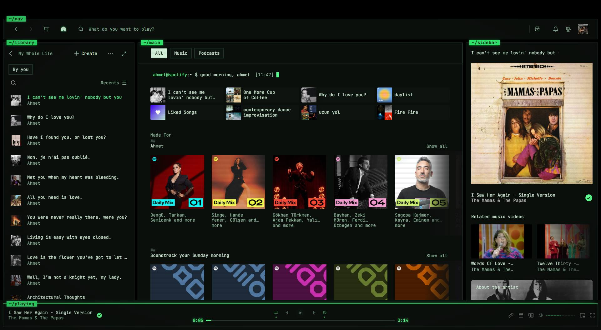
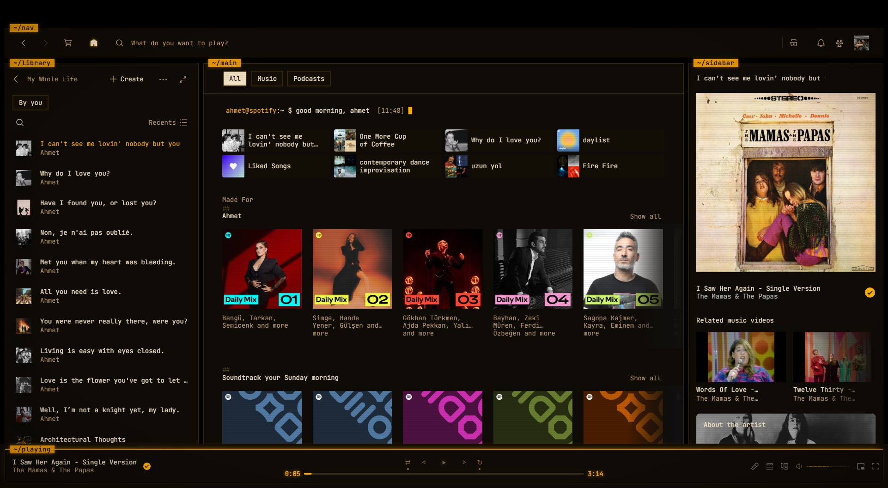
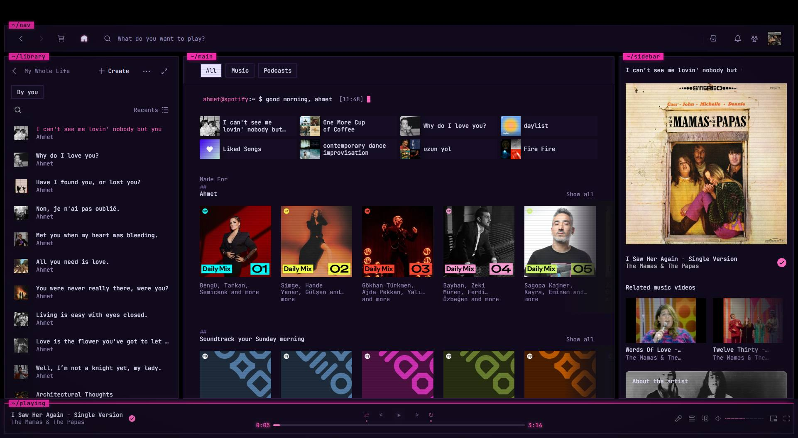
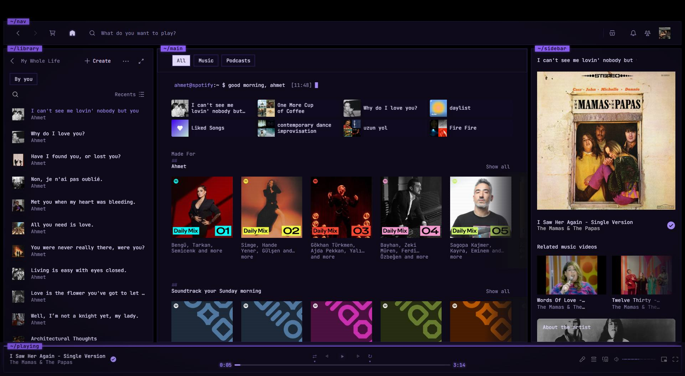
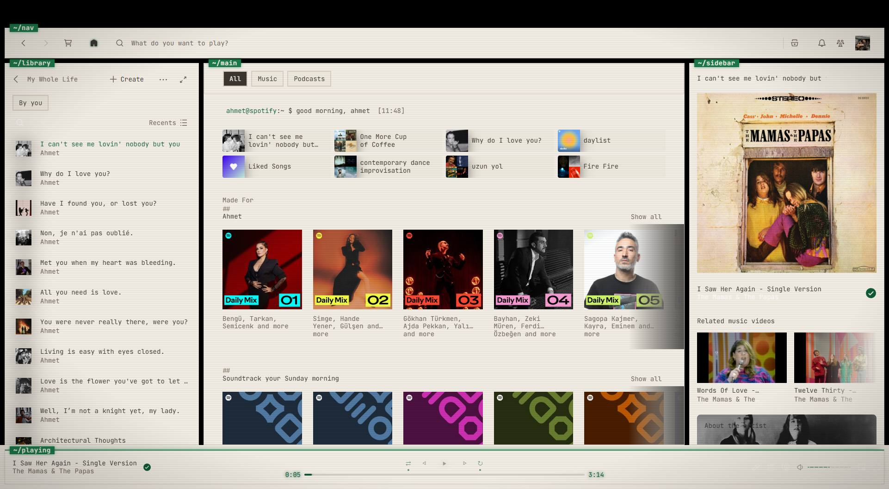
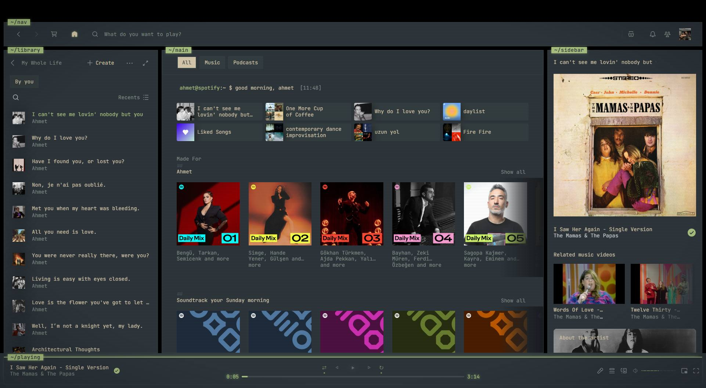
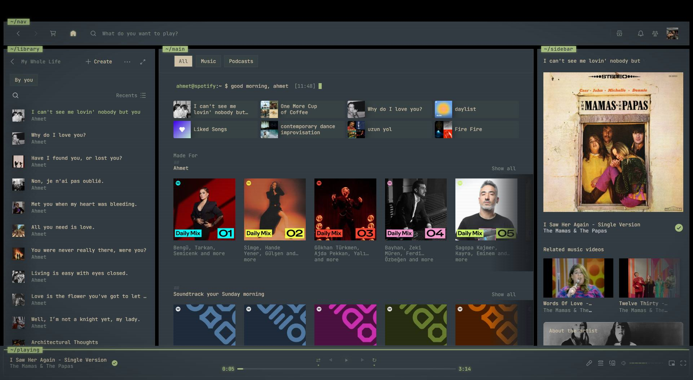

# termspot

by [fdeox](https://github.com/fdeox) — a CRT phosphor terminal theme for Spotify (via [Spicetify](https://spicetify.app)).

Scanlines, vignette, phosphor glow, a power-on warm-up, tmux-style pane chips
(`~/nav`, `~/library`, `~/playing`), a statusline playbar, terminal control
glyphs, `## ` shelf headers, `> UPPERCASE` page titles and a `>>` lyrics cursor.
Your Spotify, running on a machine from a better timeline.

> Pairs perfectly with the [Terminal Greeting](https://github.com/fdeox/spicetify-terminal-greeting)
> extension: boot log, terminal prompt with time-of-day greeting, now-playing
> ticker and night shift.



## Color schemes

Switch any time:

```
spicetify config color_scheme <SchemeName>
spicetify apply
```

| | |
|---|---|
| **Fdeox** *(default)* — green phosphor  | **FdeoxAmber** — amber phosphor  |
| **Synthwave** — neon night drive  | **Arctic** — cold storage  |
| **Bloodmoon** — alarm mode  | **Ultraviolet** — blacklight  |
| **Paper** — e-ink daylight  | **Gruvbox**  |
| **GruvboxHard**  | **EverforestDarkHard**  |
| **EverforestDarkMedium**  | **EverforestDarkSoft**  |

## CRT knobs

At the top of `user.css`:

```css
--crt-scanlines: block;  /* none to disable */
--crt-vignette: block;   /* none to disable */
--crt-glow: 6px;         /* 0px to disable  */
--crt-poweron: termspot-power-on 0.9s ease-out 1; /* none to disable */
```

## Install

```
# copy (or symlink) this folder into your spicetify Themes folder as "termspot"
spicetify config current_theme termspot
spicetify config color_scheme Fdeox
spicetify apply
```

## Credits

Structure inspired by the [text](https://github.com/spicetify/spicetify-themes/tree/master/text)
theme by darkthemer (spicetify-themes, MIT).
